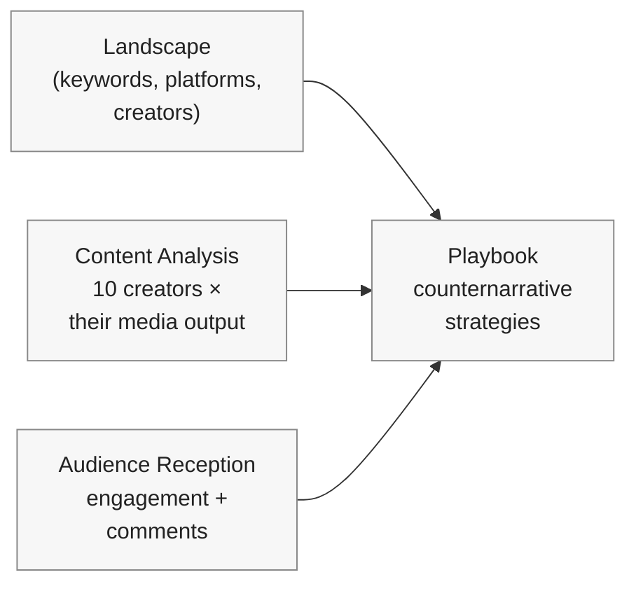
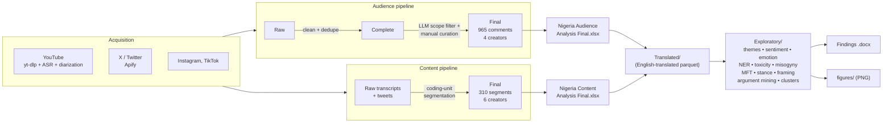
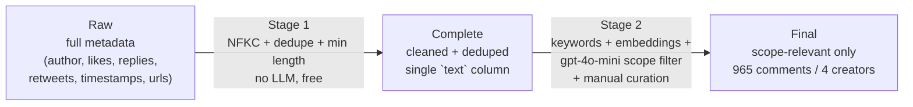
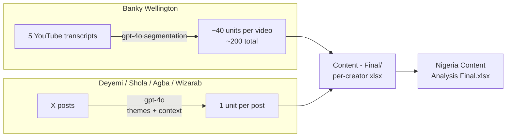
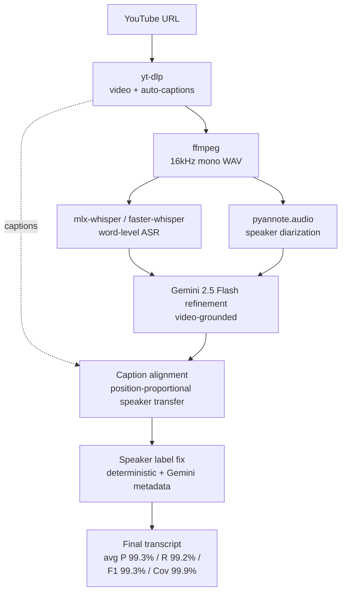

# GATES Manfluencer Project

**Norman Lear Center, USC Annenberg — Gates Foundation**

Pipeline for transcribing, cleaning, scoping and analyzing masculinity-focused media (X, YouTube, TikTok, Instagram) and audience comments in **Kenya** and **Nigeria**. Ten creators total — five per country, mix of progressive and regressive.

The bulk of the implementation right now is on the **Nigeria** side. Kenya has the raw scrapes and an earlier-pass topic filter; the Nigeria pipeline can be cloned over once the codebook is locked.

---

## What we're studying



Four moving parts, all feeding the eventual playbook deliverable. This repo is the technical scaffolding for the middle two (content + audience).

### The 10 creators

| Creator | Country | Orientation | Platform | Focus |
|---|---|---|---|---|
| Eric Amunga (Amerix) | Kenya | regressive | X | Sexual hierarchy, female submission, #MasculinitySaturday |
| Andrew Kibe | Kenya | regressive | X / YouTube | Anti-women cynicism, status, male advice |
| Philip Karanja | Kenya | progressive | YouTube | Fatherhood (Girl Dad), VAW, allyship |
| Onyango Otieno (Rixpoet) | Kenya | progressive | YouTube | Trauma recovery, anti-toxic masculinity, mental health |
| Eddy Kimani | Kenya | progressive | TikTok / YouTube | Depression, failure recovery, men's mental health |
| Banky Wellington | Nigeria | progressive | YouTube (MENtality) | Healthy masculinity, marriage, fatherhood, vulnerability |
| Deyemi Okanlawon | Nigeria | progressive | X | Male accountability, rape culture, anti-deflection |
| Wizarab | Nigeria | regressive | X | Denigrating women, feminists, single mothers |
| Shola | Nigeria | regressive | X | Availability trap, female submission, provider anxiety |
| Agba John Doe | Nigeria | regressive | X | Soft patriarchy, marriage-market logic, sexual double standards |

---

## How the data flows (Nigeria)



The two `Final` workbooks are the manager-facing locked deliverables. Everything to the right of them is regenerable from cache.

---

## Repository layout

```
Gates-Manfluencer-Project/
├── Nigeria/
│   ├── Audience Analysis/
│   │   ├── Audience Comments - Raw/        # full scrapes, per creator
│   │   │   ├── Agba John Doe/
│   │   │   ├── Banky Wellington/
│   │   │   │   ├── YouTube/                # sermons (legacy, not in final scope)
│   │   │   │   ├── Instagram/              # 3 posts (legacy, not in final scope)
│   │   │   │   └── MENtality/              # 6 episodes — used for final
│   │   │   ├── Deyemi Okanlawon/
│   │   │   ├── Shola/
│   │   │   └── Wizarab/
│   │   ├── Audience Comments - Complete/   # cleaned + deduped, single `text` col
│   │   ├── Audience Comments - Final/      # the 4 manager-facing files
│   │   ├── Audience Comments - Archive/    # superseded snapshots
│   │   ├── Nigeria Audience Analysis Final.xlsx   # consolidated headline workbook
│   │   ├── Translated/                     # English-translated parquet/xlsx
│   │   └── Exploratory/                    # LLM analyses + xlsx/docx + figures/
│   ├── Content Analysis/
│   │   ├── Content - Raw/
│   │   ├── Content - Final/
│   │   ├── Content - Archive/
│   │   ├── Nigeria Content Analysis Final.xlsx
│   │   ├── Translated/
│   │   └── Exploratory/
│   ├── Notebooks/
│   │   ├── Audience Comments.ipynb         # cleaning + LLM scope filter
│   │   ├── Content Analysis.ipynb          # placeholder
│   │   ├── Data Acquisition Pipeline.ipynb # scraping + transcription
│   │   └── Exploratory Analysis.ipynb      # the LLM analyses
│   ├── Scraped Tweets/
│   └── scripts/
│       └── archive/                        # superseded one-offs
│
├── Kenya/                                  # raw scrapes, ASR transcripts, earlier-pass plots
├── Codebooks/Human Codebooks/              # 12-coder spreadsheets + assignment trackers
├── Proposed Keywords & Codebooks/          # 400+ keyword lexicon + original codebook
├── Scope/                                  # scope docs + sample analyses
├── README.md
├── requirements.txt
└── temp/                                   # caches (gitignored)
```

---

## Audience comments — three tiers



Both stages live in `Nigeria/Notebooks/Audience Comments.ipynb`.

### Tier 1 — Raw

Schema preserved exactly as scraped. YouTube: `author, comment, likes, reply_count`. X: `author, text, likes, replies, retweets, timestamp, url`. TikTok / IG: platform-specific.

For Banky we keep three subfolders — `YouTube/` sermons, `Instagram/` posts, `MENtality/` podcast — only MENtality (6 episodes) feeds into Final.

### Tier 2 — Complete (no LLM)

Output of Stage 1. Pure deterministic processing:

- NFKC unicode normalization
- Smart-quote replacement, whitespace collapse
- Drop empties + comments under 5 chars
- Drop exact dupes
- Single `text` column, one-to-one mirror of Raw

Free, fast, repeatable.

### Tier 3 — Final

Output of Stage 2 plus a manual review pass. The notebook does the heavy lifting:

- **2a** — keyword annotation against the NLC lexicon
- **2b** — embedding similarity to per-orientation anchors (`text-embedding-3-large`)
- **2c** — relevance check via `gpt-4o-mini` (async, batched, cached)
- **2d** — composite score `0.20·keyword + 0.35·similarity + 0.45·relevance`, top-N per source
- **2e** — faith strip (substantive religious framing only — colloquial idioms stay)
- **2f** — export to `Audience Comments - Final/<Creator>_<PostTitle>.xlsx`

Manual curation on top of that removed: dupes, OP-text leakage, generic praise, format critiques, weak jokes, and `@grok` bot pings. The four locked outputs:

| Creator | Source | Comments |
|---|---|---:|
| Agba John Doe | X — *Never Leave Marriage Because Husband Cheated* | 177 |
| Shola | X — *7 Women Will Beg One Man to Marry* | 89 |
| Deyemi Okanlawon | X — *Stop Raping Women Response* | 194 |
| Banky Wellington | YouTube — *MENtality Podcast* (6 episodes pooled) | 505 |
| **Total** | | **965** |

> Re-running the notebook would overwrite these. Don't, unless you genuinely want to start fresh.

---

## Content analysis

Per-creator coding-unit datasets in `Nigeria/Content Analysis/Content - Final/`. Schema mirrors the Kibe / Jagero reference: `Segment ID | Influencer | Platform | Content Type | Theme(s) | Context (NOT CODED) | Verbatim Text (CODE THIS)`.



Banky's segmentation restores punctuation and capitalization on raw ASR and preserves Pidgin / Yoruba code-switching. The shorter X-post creators get one unit per tweet.

`Nigeria/Notebooks/Content Analysis.ipynb` is currently a skeleton — full pipeline is the next implementation task.

---

## Data acquisition + transcription

`Nigeria/Notebooks/Data Acquisition Pipeline.ipynb` is the consolidated entry point. It covers comment scraping (X via Apify, YouTube via yt-dlp, IG) and the video transcription pipeline.



Stages, in order:

1. **Acquire** — `yt-dlp` pulls video + auto-captions; `ffmpeg` produces 16kHz mono WAV
2. **ASR** — `mlx-whisper` (Apple Silicon) or `faster-whisper` for word-level timestamps
3. **Diarization** — `pyannote.audio` assigns speaker IDs to time segments
4. **Refine** — `gemini-2.5-flash` cleans up the raw ASR + diarization with the video as context
5. **Caption alignment** — `align_transcripts_with_captions.py` treats YouTube captions as authoritative and transfers speaker labels onto them by position. This kills LLM over- and under-generation.
6. **Speaker fix** — `fix_speaker_labels.py` does deterministic cleanup plus a Gemini-assisted relabel using channel metadata.

All 15 transcripts (10 Kenya + 5 Nigeria) hit research-grade accuracy. Per-transcript breakdown lives in `Kenya/Generated Transcripts/`.

---

## Keyword lexicon

`Proposed Keywords & Codebooks/NLC Proposed keywords.xlsx` — 400+ entries across three sheets:

- **Nigeria** — Pidgin, Yoruba, Igbo, Hausa slang ("ashawo", "agba baller", "yahoo boy", "woman-wrapper"...)
- **Kenya** — Swahili, Sheng, Gikuyu ("malaya", "mubaba", "mwanaume ni jasho"...)
- **Sources** — academic + popular references on African masculinity discourse

Each term is tagged Highly / Moderately / Not relevant.

---

## Setup

```bash
python -m venv .venv
source .venv/bin/activate
pip install -r requirements.txt
```

Drop a `.env` at the repo root:

```
OPENAI_API_KEY=...
GEMINI_API_KEY=...
HF_TOKEN=...
APIFY_API_KEY=...
```

Key deps: `mlx-whisper` / `faster-whisper`, `pyannote.audio`, `google-genai`, `openai`, `apify-client`, `yt-dlp`, plus `pandas` / `openpyxl` / `pyarrow`. `ffmpeg` needs to be on PATH as a system binary.

---

## Running things

**Audience scope filter (Nigeria).** Open `Nigeria/Notebooks/Audience Comments.ipynb`. Stage 1 (cleaning) is free and instant. Stage 2 (LLM filter) costs ~$3–5 on a fresh run; cache makes re-runs free. The 4 Final files are manually curated past the notebook output — re-running will overwrite them.

**Translation.** `python Nigeria/scripts/translate_to_english_pipeline.py` writes English-translated parquets + xlsx into `Nigeria/Audience Analysis/Translated/` and `Nigeria/Content Analysis/Translated/`. Cached on `temp/translation_cache.parquet`.

**Exploratory analyses.** `Nigeria/Notebooks/Exploratory Analysis.ipynb` reads the Translated parquets and writes the two consolidated workbooks, parquets, and figures into each tier's `Exploratory/` folder. ~$2–5 + 5–10 min wall time on a cold run; free after that.

**Findings docs.** `python Nigeria/scripts/build_findings_docs.py` regenerates the two `Nigeria - * LLM Exploratory Findings.docx` files.

**Content analysis (Nigeria).** Notebook is a placeholder. Coding-unit data is already in `Content Analysis/Content - Final/`.

**Audience scope filter (Kenya).** Not built yet. Plan: copy the Nigeria notebook into a new `Kenya/Notebooks/`, swap the country in the config cell, run.

**Data acquisition.** `Data Acquisition Pipeline.ipynb` covers transcription stages today; scraping cells will be folded in to consolidate the standalone scrapers in `Nigeria/scripts/`.

---

## Status

| Component | State |
|---|---|
| Transcription, Kenya (10 videos) | done — avg F1 99.2% |
| Transcription, Nigeria (5 videos) | done — avg F1 99.5% |
| Caption ground truth | available for all 15 |
| Nigeria raw audience comments | collected (10,819 → cleaned to Complete) |
| Nigeria Stage 2 scope filter | notebook in place; Final manually curated |
| Nigeria audience Final | **locked — 965 comments × 4 creators** |
| Nigeria content coding units | in place; pipeline notebook pending |
| Nigeria translated + exploratory | done (417 audience / 310 content rows analyzed) |
| Kenya raw audience comments | collected (10 datasets); Final pending |
| Kenya audience plots | from earlier pass, on disk |
| Codebook | defined |
| Keyword lexicon | 400+ terms, two countries |
